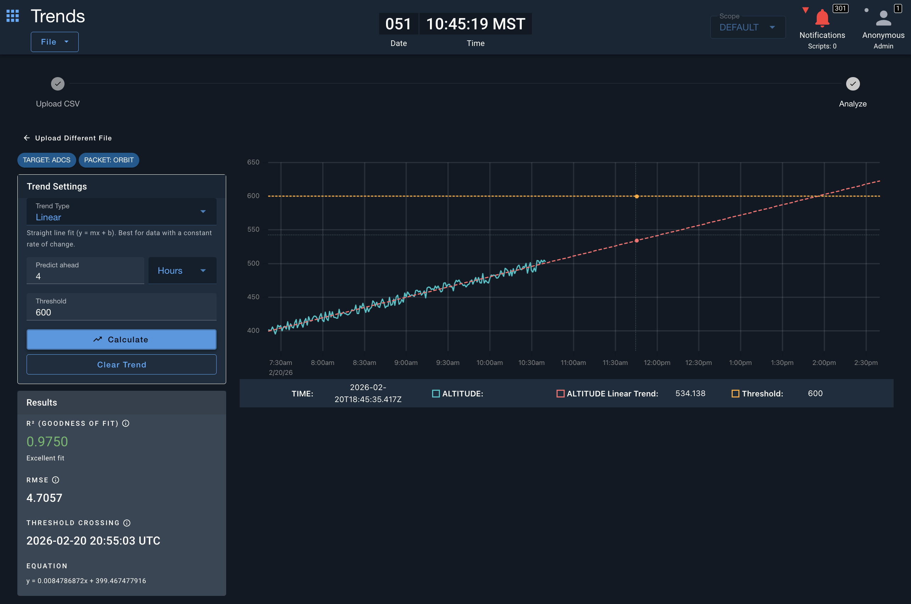

# OpenC3 COSMOS Trends

A trend analysis tool for [OpenC3 COSMOS](https://openc3.com). Upload telemetry CSV data, fit trend models, and forecast future values.



## Features

- **Upload CSV** — Import data exported from Data Extractor (timestamp + numeric columns)
- **9 Trend Models** — Linear, Polynomial, Exponential, Logarithmic, Power, Sinusoidal, Simple Moving Average, Exponential Moving Average, Holt's Linear
- **Forecasting** — Predict ahead with configurable time horizon
- **Threshold Crossing** — Set a threshold and see when the trend line is predicted to cross it
- **Export** — Save charts as PNG or trend data as CSV

## Building

```
pnpm install --frozen-lockfile --ignore-scripts
rake build VERSION=1.0.0
```

Or using Docker:

```
docker run -it -v `pwd`:/openc3/local:z -w /openc3/local docker.io/openc3inc/openc3-node sh
pnpm install --frozen-lockfile --ignore-scripts
rake build VERSION=1.0.0
```

## Installing

1. Go to the OpenC3 Admin Tool, Plugins Tab
2. Click Install and choose the `.gem` file
3. Fill out plugin parameters and click Install

## License

Released under the MIT License. See [LICENSE.md](LICENSE.md).
