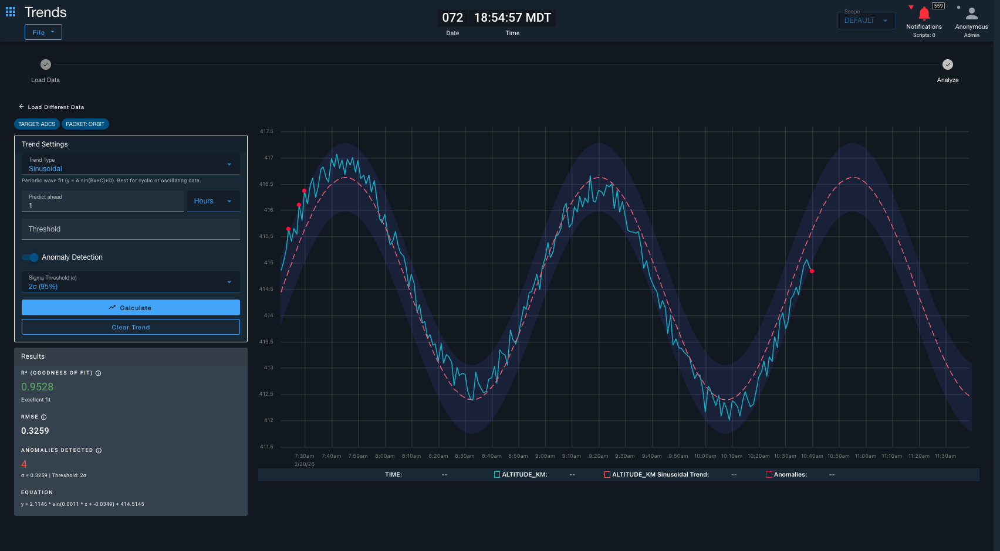

# OpenC3 COSMOS Trends

A trend analysis plugin for [OpenC3 COSMOS](https://openc3.com). Load telemetry data from CSV files or live connections, fit statistical trend lines, and predict future values.



## Features

- **Data Sources** — Import CSV from Data Extractor or connect to live telemetry
- **Trend Fitting** — Linear, polynomial, exponential, logarithmic, power, and sinusoidal curve fits with R² and RMSE metrics
- **Forecasting** — Extrapolate trends into the future with configurable time horizons
- **Threshold Crossing** — Set a threshold and see when the trend is estimated to reach it
- **Anomaly Detection** — Flag data points outside N standard deviations from the trend, with sigma band visualization
- **Limits Overlay** — Display COSMOS item limits (red/yellow/green) on the chart
- **Export** — Save charts as PNG or export trend data as CSV

## Building

```
pnpm install --frozen-lockfile --ignore-scripts
rake build VERSION=1.0.0
```

Or using Docker:

```
docker run -it -v `pwd`:/openc3/local:z -w /openc3/local docker.io/openc3inc/openc3-node sh
pnpm install --frozen-lockfile --ignore-scripts
rake build VERSION=1.0.0
```

## Installing

1. Go to the OpenC3 Admin Tool, Plugins Tab
2. Click Install and choose the `.gem` file
3. Fill out plugin parameters and click Install

## License

Released under the MIT License. See [LICENSE.md](LICENSE.md).
